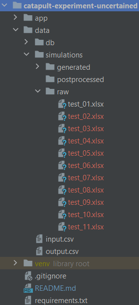
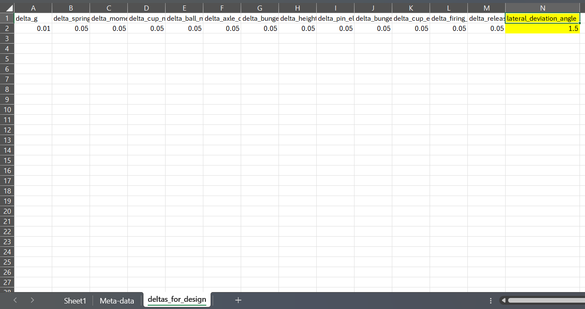
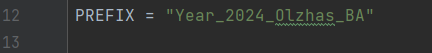

# Project: "Meta-analysis of virtual experiments employing a DoE-Database"

---

## Installing process
Follow the instructions below to set-up the project at your local machine:

1. Create a directory you want to set up the project in, and open it with terminal that supports Git commands, e.g. "Git for Windows CMD".
2. Copy the repository with the following command: 
  -  `git clone https://github.com/ozzy110400/catapult-experiment.git`
3. Get into directory the repository was copied into with the following command:
  - `cd catapult-experiment`
4. Make sure to have Python 3.11.0 and set up dependency libraries with the following commands:
  - `python -m venv .` (With the dot)
  - `scripts\activate`
  - `pip install -r requirements.txt`

After all the required libraries are installed you are ready to work with the simulation.

---

## Preparing for the simulation
Under the `data/simulations/raw` directory (refer to the picture below), save all the experiments designs. Each file should contain three sheets with factors' values, Meta-data for DoE database and deltas amplitudes (refer to a sample file for an example).

All the deltas' amplitudes are stated as a ratio to absolute value of a variable, e.g. absolute value of amplitude of uncertainty in g equals `g * delta_g`.
That is true for all deltas on the `deltas_for_design` sheet of the file except for the last one: "laterl_deviation_angle". This one is stated in degrees, since there is no such variable in core part of the simulation.

To change the prefix of the experiments that will be written down in the DB, change the following line of code with a prefix that suits you in the `app/xl2xldb.py` file.

---

## Simulation process
After all the files are prepared to be simulated, you can now proceed with the simulation process. 
To run the simulation for all the experiments run the following command from the root directory (the one, where 'app', 'data', etc. are located):
 - `python -m app/simulate.py`

In order to successfully run the code, you have to have virtual environment activated, if it is not activated, from root directory run the following command:
  `scripts\activate` or `venv\scripts\activate` depending on where you created the virtual environment files.

After the simulation process is done all the data is goung to be stored under `data/simulations/generated` directory, where you can find `stacked` directory, which will have all the experiments prepared for Cornerstone analysis. The file will have the date you run the simulation on as a prefix.

---

## Converting results to DB
In order to convert results obtained from simulations to a DB located under `data/db` directory, make sure a virtual environment is activated, and then from root directory of the project run the following command:
  - `python -m app/xl2xldb.py`

After successful conversion all the generated results are going to be stored under `data/db/db.xlsx` file.

---

## Remark about possible errors
In order to successfully write down data during simulation and DB Conversion, make sure to close any open Excel files, as it may prevent any data from being written down to those files.
